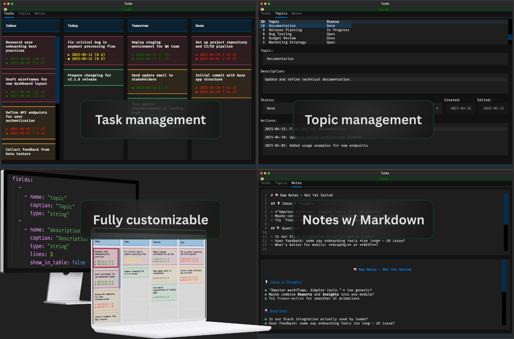

# Tuido – Efficient Day Planning in your Terminal

> Tuido is a simple productivity application that provides a text user interface (TUI) for managing tasks, topics and notes. The Kanban columns of the task view and the fields of the topics can be defined by the user. All data are saved locally – no cloud requirement.

Many productivity apps offer an overwhelming number of features that you often don't actually need. Their complexity might slow you down. Tuido takes a different approach: minimalism. It gives you a clean, reliable space to plan your day as efficiently as possible.

The components are built using the Textual library, offering a modern terminal UI experience focused on clarity and interactivity.

The purpose of this application is to provide a space for planning and organizing the current day. With its keyboard-driven, minimalist interface, it aims to support an efficient workflow. It is not intended for long-term planning and is meant to complement apps like Notion or OneNote, not replace them.

Use Tuido for everything that is relevant today but can be deleted in the next few days. Tuido aims to help you separate temporary stuff from your personal knowledge management.

> [!warning]
> This application is under development. It's not yet suitable for a productive environment.

> [!tip] Current Status
> See the [Roadmap](#roadmap) and [Todo list](TODO.md) to gain an insight into the current project status.

## Core Features

- Minimalistic text user interface – no overhead
- Full keyboard navigation (but mouse interaction is also supported)
- Manage tasks in a Kanban system with user-defined columns
- Manage topics in a simplified database view with customizable fields
- Quick notes (displayed as text, as rendered Markdown or both)

## Feature Details

Tuido is divided into three tabs: Tasks, Topics and Notes.

### Task management

The Tasks module helps you organize your day by managing current tasks in a Kanban system. It is designed to mainly focus on what matters today – simple, fast and effective.

**Key features:**

- Create, edit and delete tasks
- Move tasks between columns
- Change number of columns an their titles
- Tasks are automatically sorted in the following order: priority, start date, end date, title
- Each tasks supports the following fields:
  - Title
  - Priority
  - Start Date
  - Due Date
- All changes are saved automatically

**Use cases:**

- Plan your day with a few concrete, actionable tasks
- Stay focused by seeing only what’s relevant now
- Clear out finished tasks at the end of the day to keep your board clean

### Topic management

The Topics tab provides a structured way to organize information belonging to different topics that is relevant beyond just today – for example ongoing ideas.

While the task view is designed for immediate, short-lived actions, topics offer a more stable, form-based overview that supports medium-term planning and documentation.

**Key features:**

- Display all topics in a table view for quick navigation
- Show and edit topic details in a dynamic form
- Changes can be saved or discarded

Each topic is made up of fields defined by the user. The layout of the form and table adapts to these custom fields, allowing Tuido to be **tailored to your workflow**.

**Supported field types:**

- `string` – for free text like titles or comments
- `date` – for scheduling and deadlines
- `select` – for statuses, categories or priorities

You can define the structure of topics in the `config.yaml` file. This allows you to model exactly the information you need – **and nothing more**.

**Use cases:**

- Keep track of your ongoing projects or areas of responsibility
- Save notes on meetings
- Define and follow up on goals, decisions or documentation

The topic management module helps you maintain clarity and focus by separating ongoing, structured data from the more dynamic daily task view.

### Notes

The Notes tab is your space for unstructured, short-lived information – things that don't yet belong in a task or topic, but still matter right now.

Whether it's meeting notes, rough ideas, phone numbers or spontaneous thoughts – this module offers a lightweight way to capture temporary information quickly and without distraction.

**Key features:**

- A simple text editor built directly into the terminal UI
- Supports both plain text and rendered Markdown
- Toggle between raw, rendered or split view
- All changes are saved automatically – no need to press save

**Use cases:**

- Jot down ideas or thoughts throughout the day
- Take notes during meetings or calls
- Use Markdown to structure ad-hoc content (e.g. TODO lists, outlines)
- Store temporary content that doesn’t need to be kept long-term

Notes are intended to be transient – they're not part of a long-term knowledge base. If something becomes important or structured, move it to a Topic or Task.

## Roadmap

### Version 0.1 – Foundation

- [x] Basis topic management (CRUD)
- [x] Basic task management (CRUD)

### Version 0.2 – Interoperability

- [ ] Import and export tasks as CSV
- [ ] Import and export topics as CSV

### Version 0.3 – Usability Enhancements

- [ ] Custom sort order for topics
- [ ] Filtering and searching topics

### Version 0.4 – Extended Customization

- [ ] More field types for topics: `bool`, `multiselect`, `number`
- [ ] Custom keyboard shortcuts via config

### Version 0.5 – Advanced Workflow

- [ ] Task history/changelog
- [ ] Duplicate task/topic

### Version 0.6 - Smart Fields

- [ ] Validations for topic fields
- [ ] More field functions for topics

### Possible Future Features

- [ ] Multilingual support
- [ ] Time tracking per task
- [ ] Task recurrence (e.g. daily, weekly tasks)
